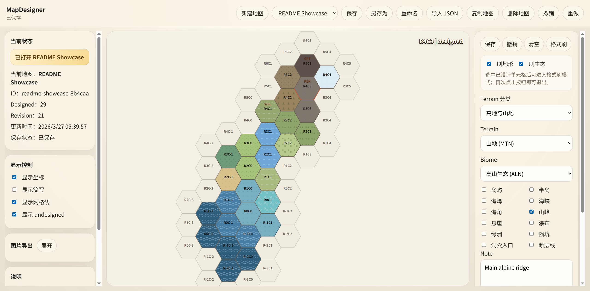

# MapDesigner

[](./package.json)
[](https://nodejs.org/)
[](https://pnpm.io/)
[](./LICENSE)
[](./README.zh-CN.md)

When building a fictional world, the map often changes along with the setting. Coastlines shift, regions are redefined, climates are adjusted, and what began as a simple sketch can quickly turn into a messy mix of images and notes. MapDesigner is a local-first hex map design tool for keeping that process editable, structured, and easier to maintain.

It combines a visual WebUI with a structured CLI, so the same map can evolve alongside the worldbuilding process. Instead of only editing after the design is finished, creators can discuss ideas with AI agents and apply structured map changes as the setting takes shape.

## Core Features

- Edit hex-based maps in a visual WebUI
- Layer terrain and biome data on each cell
- Save maps as structured JSON and reopen them later
- Export rendered maps as PNG references
- Inspect and modify maps through a structured CLI for scripts and AI agents
- Use the same map rules across WebUI, CLI, and exports

## Screenshot



## Quick Start

### Run from source

```bash
pnpm install
pnpm build
pnpm start
```

Then open `http://localhost:3010`.

### Run with Docker

```bash
docker build -t mapdesigner:0.1.0 .
docker run --rm -p 3010:3010 -e MAPDESIGNER_ROOT=/data -v "$(pwd)/mapdesigner-data:/data" mapdesigner:0.1.0
```

Then open `http://localhost:3010`.

For detailed setup steps, see the [Deployment Guide](./docs/deployment.md) and [Docker Guide](./docs/docker.md).

## AI Agent / CLI

MapDesigner ships with a structured CLI so scripts and AI agents can inspect maps, apply deterministic edits, and export results without touching the WebUI.

```bash
pnpm exec tsx apps/server/src/cli.ts maps inspect-cell --map-id my-map --row 0 --col 0
```

More examples and command conventions are documented in [Agent CLI Guide](./docs/agent-cli.md).

## Documentation

- [User Manual](./docs/user-manual.md)
- [Deployment Guide](./docs/deployment.md)
- [Docker Guide](./docs/docker.md)
- [Agent CLI Guide](./docs/agent-cli.md)
- [Product Overview](./PRODUCT_OVERVIEW_0.1.0.md)
- [Changelog](./CHANGELOG.md)
- [中文说明](./README.zh-CN.md)

## Current Status

`v0.1.0` is the first usable public release. The core workflow is already covered: create maps, edit hex cells in the browser, save and reopen JSON files, export PNG references, and drive the same map data through a structured CLI.

## License

This project is licensed under the [GNU General Public License v3.0](./LICENSE).
