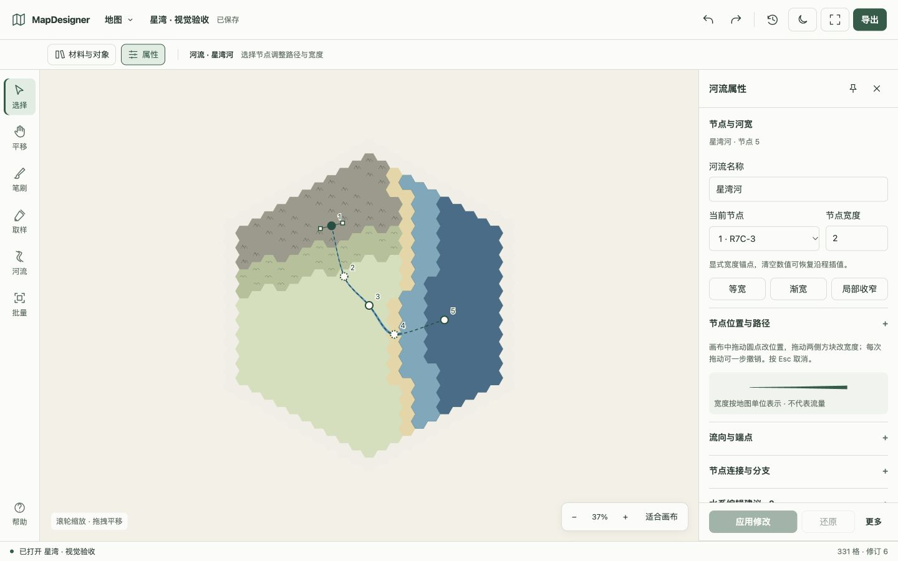

# MapDesigner 中文说明

MapDesigner 是一个本地优先的六角格地图设计工具，适合异世界设定、世界观构建、跑团参考地图和与 AI 协作的结构化地图编辑。

它把可视化 WebUI 和结构化 CLI 放在同一套规则之上，让你既可以一边看地图一边修改，也可以在与 AI 讨论设定的过程中，直接通过命令对地图做稳定、可重复的调整。

## 功能概览

- 在浏览器中编辑六角格地图
- 为每个单元格叠加 `terrain` 与 `biome`
- 在 WebUI 或 CLI 中以覆盖层方式绘制跨单元格河流，并支持宽度锚点与水域端点提示
- 以本地 SQLite 存储地图，并保留结构化 JSON 导入/导出用于归档和交换
- 使用可搜索的材料样本、取样、笔刷及直接河流节点/宽度编辑
- 以共享地貌符号、生态纹理、全图图例和连续水面表达地图
- 真实预览并导出带标题、图例、透明背景和格距说明的 PNG
- 流式导入大 JSON 文件，按区域或整图导出附位置清单与索引页的分块图片包
- 预览位置与重叠后合并地图，复制河流，并持久化保存整次合并的撤销/重做历史
- 通过 CLI 进行查询、批量修改与导出
- 针对大地图使用摘要与范围查询，避免默认读取所有单元格
- 让 WebUI、CLI 与导出结果共享同一套地图规则

## 快速开始



桌面、窄屏与操作验证见[验收记录](./docs/research/README.md)。

### 源码运行

```bash
pnpm install --frozen-lockfile
pnpm build
pnpm start
```

然后访问 `http://localhost:3010`。

### Docker 运行

```bash
docker build -t mapdesigner:0.3.0 .
docker run --rm -p 127.0.0.1:3010:3010 -e MAPDESIGNER_TOKEN=replace-with-a-long-random-token -v mapdesigner-data:/data mapdesigner:0.3.0
```

然后访问 `http://localhost:3010`。

已有安装请先阅读[升级步骤](./docs/deployment.md#升级到-v030)，再使用原有数据启动新版本。
Docker 启动后，在地图菜单的“连接设置”中输入令牌。

## 文档导航

- [文档总入口](./docs/index.md)
- [英文 README](./README.md)
- [用户说明书](./docs/user-manual.md)
- [部署说明](./docs/deployment.md)
- [Agent CLI 指南](./docs/agent-cli.md)
- [开发指南](./docs/development.md)
- [验收记录与待补项目](./docs/research/README.md)
- [版本变更记录](./CHANGELOG.md)

## 当前版本

[`v0.3.0`](https://github.com/NecrosisO-O/mapdesigner/releases/tag/v0.3.0) 正式版包含重设计的工作区、可视化材料绘制、直接河流编辑、共享制图表现，以及使用 SQLite 保存的地图和持久撤销/重做历史。同时提供流式大文件导入、更快的远景查询、分块图片包和地图合并。使用方法见[用户手册](./docs/user-manual.md)，完整变化见[版本记录](./CHANGELOG.md)，测量和验收依据见[容量与流程记录](./docs/research/large-map-capacity/README.md)。

## 开发说明

Node.js 版本见 `.nvmrc`，pnpm 版本见 `package.json`。
执行 `pnpm install --frozen-lockfile` 后，可以用 `pnpm check` 完成构建、类型检查与测试，
用 `pnpm dev` 同时启动后端和 WebUI。
环境准备、验证流程和维护脚本见[开发指南](./docs/development.md)。

本项目在开发过程中使用了 AI 辅助。

## 许可证

本项目采用 [GNU General Public License v3.0](./LICENSE)。
