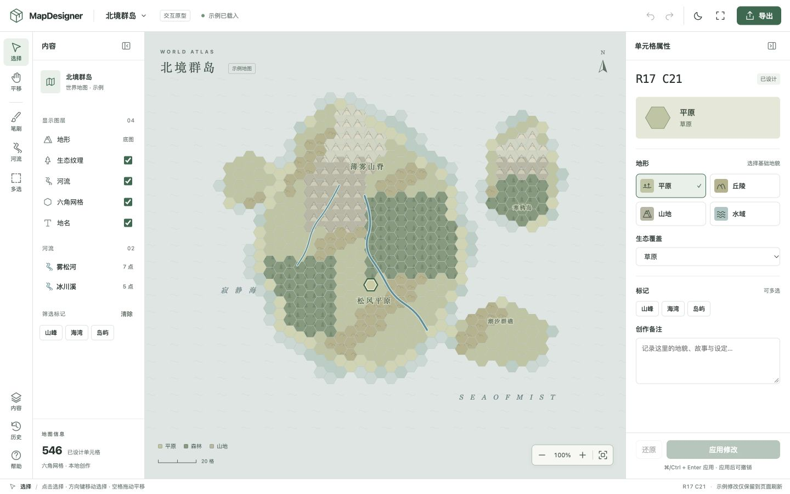
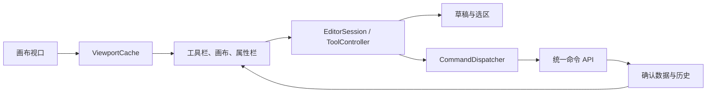

# MapDesigner 编辑器设计原型

> 历史原型：正式编辑器已完成 React 实现。本目录保留当时的交互设计与截图；当前规范见 [editor-v3](../editor-v3/README.md)，启动正式应用见[开发指南](../../development.md)。

日期：2026-10-02。对应[前端操作与布局审查](../../research/2026-10-02/frontend-review.md)。

这是可交互的工作区设计，使用 546 格群岛示例验证布局与操作反馈。
原型由独立 HTML、CSS、JavaScript 组成，没有 API 请求。修改保留在当前页面内存中，
刷新即恢复示例；它尚未接入正式 React 编辑器、数据库、地图规则与持久历史。

## 本机预览

在仓库根目录运行：

```sh
python3 -m http.server 5174 --bind 127.0.0.1 --directory docs/design/editor-v2
```

浏览器打开 `http://127.0.0.1:5174/`。无需额外前端依赖。
也可直接打开 [index.html](./index.html)。



[深色界面](./dark.jpg) · [窄屏画布](./mobile.jpg) · [窄屏属性抽屉](./mobile-inspector.jpg)

## 空间与操作分工

| 区域 | 内容 | 行为 |
| --- | --- | --- |
| 顶栏 | 地图名称、全局状态、撤销重做、主题、专注、导出 | 正式版的地图管理、新建和导入进入独立流程 |
| 工具栏 | 选择、平移、笔刷、河流、多选 | 只保留一个主工具，按住空格临时平移 |
| 内容栏 | 显示图层、河流列表、标记筛选 | 可以收起；较窄窗口改为抽屉 |
| 地图画布 | 地图、选择反馈、当前工具提示、缩放控制 | 尽量占用剩余空间，支持专注模式 |
| 属性栏 | 当前单元格、河流或当前工具的选项 | 随上下文切换；提交按钮固定在底部 |
| 状态栏 | 当前工具、操作提示、坐标 | 正式版补充请求状态和后台任务进度 |

界面使用低饱和绿色强调选中与主要动作，地图依靠地形颜色、纹理和标签共同表达。
深色切换作用于工作区界面，地图保留自己的制图配色。

## 原型中可体验的流程

- **单格属性**：选择地形、生态、标记和备注，明确显示未应用状态；应用与还原分开。
- **草稿保护**：更换编辑对象或进入其他编辑工具时，可以继续编辑、放弃、应用后继续。
- **笔刷**：单格或相邻范围，拖动经过多个格子，松开形成一次历史。
- **多选**：点击加入或移出选区，选择不依赖视口；字段默认为“保持原值”，提交前显示范围。
- **河流**：点击放置路径点、设置名称与宽度、完成绘制；已有河流可以在画布或内容栏选择。
- **历史**：属性应用、笔刷、批量和河流可撤销重做；历史栏显示已完成步骤。
- **画布**：平移、鼠标位置缩放、缩放按钮、适合画布、图层开关、标签筛选、专注模式。
- **导出**：当前图层的示例 SVG 或 PNG，1100 × 850 / 2200 × 1700，可选透明背景。

| 快捷键 | 操作 |
| --- | --- |
| V / H / B / R / M | 选择 / 平移 / 笔刷 / 河流 / 多选 |
| 空格 + 拖动 | 焦点在画布时临时平移 |
| 方向键 | 画布中的单元格导航 |
| Enter | 对当前格操作；河流工具中完成河流 |
| Shift + Enter | 河流工具中添加当前格为路径点 |
| ⌘/Ctrl + Enter | 应用单格属性 |
| ⌘/Ctrl + Z / Shift + Z | 撤销 / 重做 |
| F / ? | 适合画布 / 快捷键说明 |
| Escape | 草稿保护或关闭窄屏侧栏 |

## 正式版的交互契约

1. **选区独立于视口。** 编辑对象按地图 ID 与对象 ID 定位。离开可见范围不清空选区或草稿。
2. **草稿归属于会话。** 切图、新建、导入、复制和关闭统一检查草稿；旧地图的异步结果不能覆盖新会话。
3. **保存状态诚实。** 区分未应用草稿、排队、提交中、已持久化、失败；状态覆盖地图元数据、单元格和河流。
4. **批量操作是字段补丁。** 每个字段显式选择保持、设置或清除；标记支持增加、移除、替换。
5. **修改范围始终可见。** “选中 N 格”“全图”分开；全图替换先展示影响数量和结果预览。
6. **每个手势对应一次历史。** 连续笔刷积累一个命令组，取消手势恢复原状态，成功提交后成为一步撤销。
7. **操作结果可追踪。** 每张地图统一排队或合并提交，检查修订版本；失败保留草稿并提供重试。
8. **输入方法完整。** 可见缩放控件、画布键盘入口、工具快捷键、焦点恢复、可操作的触摸控件。

## React 实现边界

沿用 React、TypeScript 和共享地图包，把状态归属整理清楚后再接入工作区组件。
原型的单文件内存状态仅用于演示；正式版使用下面的边界。

| 模块 | 负责 | 不应由其驱动的状态 |
| --- | --- | --- |
| `EditorSession` | 地图 ID、会话代次、当前修订、会话切换 | 具体控件布局 |
| `DocumentStore` | 已确认的元数据、实体、历史能力 | 未应用的表单输入 |
| `DraftStore` | 按对象键保存草稿、原始版本、校验和 dirty 状态 | 视口可见性 |
| `SelectionStore` | 单选、河流选择、多选 ID 集 | 当前返回的视口数组长度 |
| `ToolController` | 主工具状态、手势生命周期、切换保护 | 页面上多个互相独立的模式开关 |
| `ViewportCache` | 范围请求、空间缓存、裁剪、失效 | 当前地图身份和草稿的替换 |
| `CommandDispatcher` | 命令分组、提交状态、去重、版本检查、错误和重试 | 每个按钮各自维护的提交流程 |



建议组件边界：`EditorShell`、`DocumentBar`、`ToolRail`、`ContentPanel`、`MapViewport`、
`Inspector`、`CellInspector`、`RiverInspector`、`BatchInspector`、`HistoryPanel`、`ExportDialog`。
组件表达状态、发出事件；领域校验继续来自共享地图包。

## 验证与限制

浏览器实际验证记录见 [qa-results.json](./qa-results.json)。

已检查草稿切换保护、平移后备注保留、应用与撤销重做、批量保留未修改字段、
河流完成与撤销、三格连续笔刷的一步撤销、方向键导航、原生按钮空格操作、图层开关、
浅色/深色界面，以及 1440 × 900、1024 × 768、375 × 812、812 × 375 布局。
PNG 下载产物检查为 1100 × 850；浏览器未记录错误或警告。

本原型未覆盖多地图管理、持久化、网络竞争、失败重试、导入、全图替换、格式刷全部选项、
河流控制点拖动和宽度锚点。生态与地形组合、河流路径也采用简化规则，不能作为正式地图校验。
历史使用整份示例快照，仅适合这个小规模演示。

窄屏测试是桌面浏览器视口模拟，尚未验证真实触摸、双指缩放、软键盘、系统放大和完整读屏流程。
窄屏属性抽屉会遮住部分地图；正式版还需要可调整抽屉高度和保持选中位置可见的交互。
