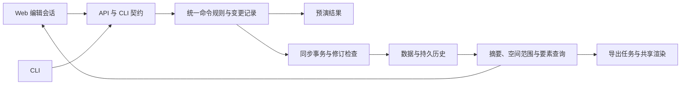

# MapDesigner 代码与架构审查

日期：2026-10-02。代码基线：`be10266`。本机：Node.js 24.16.0，macOS arm64。

后续补充：[前端操作与布局审查](./frontend-review.md)，包含五项额外复现和
[编辑器交互原型](../../design/editor-v2/README.md)。

## 判断

当前最需要重构的是命令执行、数据库事务和前端编辑会话。
这三处已经出现可复现的数据丢失和状态覆盖；大地图导入与区域导出也存在明确故障。

项目从整图内存处理迁移到 SQLite 和范围加载后，旧路径与新路径同时保留，
但命令语义、历史记录和状态模型尚未统一。完整输出与摘要输出会进入不同的执行器，
局部视口又被包装为完整的 `MapRuntimeState`。这些边界比文件行数更能解释当前问题。

已有的共享地图规则、共享 SVG 渲染、TypeScript 严格检查、SQLite 数据层和测试可以继续作为基础。
建议以统一的数据操作契约为中心推进重构；渲染后端的选择结合后续浏览器性能测量决定。

## 证据与范围

- 准备阶段的构建、类型检查和 128 项现有测试通过，详情见[接手基线档案](../../archive/takeover-notes.md)。
- 本轮阅读了 API、CLI、存储、命令、历史、范围加载、编辑会话、河流与导出路径。
- 后端探针使用自动创建并清理的临时 SQLite 数据库，直接调用现有构建产物。
- 前端探针运行实际 `useMapWorkspace`，使用内存 DOM 和可控制返回顺序的 API 替身。
- 性能样本为 1 万、10 万、50 万格；这些数据测量服务调用，不代表浏览器帧率或端到端响应时间。
- 区域导出问题仅计算场景尺寸，未分配其异常大的位图。

原始结果：

- [后端复现与测量](./backend-results.json)
- [混合命令并发复现](./mixed-results.json)
- [前端状态复现](./frontend-results.json)

以下 P1 表示应优先修复的数据正确性、核心流程或访问边界问题；P2 表示随后处理的稳定性与性能问题。

## 已复现的问题

### R1 · P1 · 预演可以回滚另一张地图的正式修改

位置：[repository.ts](../../../apps/server/src/repository.ts)，`runWithSavepoint`（158 行）、
`applyCellAndFeatureWriteChanges`（1054 行）。

单例数据库连接打开 `SAVEPOINT mixed_write` 后执行异步回调，并在其中多次 `await`。
同一连接上的其他请求可以在保存点存续期间写入；保存点名称也被所有调用复用。

实测同时执行两个服务调用：地图 A 预演“设置单元格 + 创建河流”，地图 B 正式执行相同类型的修改。
两个调用都返回成功，但 B 最终有 **0 格、0 条河流**，同时保留 **1 条可撤销历史**。
独立的仓库层探针也复现了正式写入被另一项预演回滚。

重构方向：SQLite 的事务边界内使用同步数据操作；预演通过相同规则计算变更，
避免在共享连接上跨越异步调度保留可回滚写入。仅改成唯一保存点名称无法解决连接被共享的问题。

### R2 · P1 · 并发编辑不同单元格仍会丢失修改

位置：[service.ts](../../../apps/server/src/service.ts)，`applyCommandsWithoutHistory`（1343 行）。

完整命令路径读取整张地图，执行命令，再写回整张文档。读取和写回之间缺少原子的修订检查。

实测并发设置 `R0C0` 与 `R0C1`：**两次成功、两条历史，最终只剩 1 格**。
API 的默认完整输出以及 CLI 未带 `--summary` 时会进入此路径。

重构方向：在事务内读取必要实体、检查修订号并写入变更；
完整输出与摘要输出共享同一执行过程，仅在返回数据阶段选择不同投影。

### R3 · P1 · 操作报错时，数据已经写入且无法撤销

位置：[service.ts](../../../apps/server/src/service.ts)，`applyCommands`（1596 行）、
`applyLightweightCellCommands`；[repository.ts](../../../apps/server/src/repository.ts)，`recordOperation`。

地图写入和历史写入是两个独立事务。实测在临时数据库中用触发器模拟历史写入失败：
服务返回异常，但新增单元格已经保留，`canUndo=false`、历史游标为 0。

重构方向：单元格、河流、地图修订、历史记录和历史游标在一个事务中提交或回滚。
撤销/重做同样需要覆盖数据修改与游标更新的原子边界。

### R4 · P1 · 自动命名河流的撤销会删除旧河流

位置：[service.ts](../../../apps/server/src/service.ts)，`buildInverseFeatureCommands`（1272 行）。

完整路径对未指定 ID 的 `create_river`，把排序后河流数组的最后一项当作新建对象。
实测先创建 `zz-existing`，再创建自动生成 ID 为 `alpha` 的河流，随后撤销：

| 执行路径 | 正确结果 | 实际结果 |
| --- | --- | --- |
| 完整路径 | 保留 `zz-existing` | 保留 `alpha`，旧河流被删除 |
| 摘要路径 | 保留 `zz-existing` | 保留 `zz-existing` |

另一项一致性探针发现：`set_cell` 的 `note: 123` 被完整路径拒绝，
摘要路径却接受并存成字符串 `123.0`。输入校验也发生了分歧。

重构方向：命令执行时确定实体 ID，记录已解析的命令以及实体修改前后状态，
由统一变更记录生成撤销/重做；所有入口共享运行时校验。

### R5 · P1 · 移动视口会丢掉未保存的地图名称

位置：[useMapWorkspace.ts](../../../apps/web/src/useMapWorkspace.ts)，
`renameCurrentMap`、`loadVisibleRange`（661—676 行）。

重命名修改 `currentMap.document.meta`，范围加载却从旧 `mapSummary` 重建整个运行时。
实测名称改成 `User draft` 后，`dirty=true`；请求另一块视口后，名称恢复旧值，`dirty=false`。

重构方向：将服务器摘要、元数据草稿、视口数据与保存状态分别建模。
视口响应只更新范围数据，元数据草稿由明确的保存、撤回或切换操作管理。

### R6 · P1 · 大地图导入存在两道确定的故障

位置：[repository.ts](../../../apps/server/src/repository.ts)，`normalizeBounds`（196 行）；
[api.ts](../../../apps/server/src/api.ts)，服务器创建与 `/api/maps/import`；
[useMapWorkspace.ts](../../../apps/web/src/useMapWorkspace.ts)，`importFile`。

1. 向导入接口提交约 1.1 MB 的合法文档，返回 HTTP **413**。
   当前请求上限在解析阶段生效，尚未到达导入处理器。
2. 绕过 HTTP，直接导入 **150,000 格、10,862,289 字节**的合法文档，
   `normalizeBounds` 的 `Math.min(...cells.map(...))` 触发
   `RangeError: Maximum call stack size exceeded`。

413 返回的是框架错误对象，缺少前端假定存在的 `errors` 数组。
前端探针使用实测错误格式，复现了导入处理中的 `TypeError`。

此外，浏览器 `file.text()`、CLI `readFile()`、`parseDocument()` 都会完整读取内容。
`writeDocumentBatched` 的批次循环仍然接收完整内存文档；它尚未形成流式导入。

重构方向：首先修复边界归约与错误返回，再设计有明确大小预算、进度和失败恢复能力的导入任务。
解析、校验和 SQLite 写入采用有界批次，重型工作移到独立执行单元。

### R7 · P1 · 远离原点的单格区域导出被算成约 203 亿像素

位置：[layout.ts](../../../packages/map-render/src/layout.ts)，42—45 行；
[scene.ts](../../../packages/map-render/src/scene.ts)，`buildExportScene`。

布局边界始终把坐标原点纳入 `min/max`。区域导出的边界虽然已经指定，
最终布局仍包含从原点到该区域之间的大段空间。

同样只导出一格、缩放 2、边距 32：

| 单元格位置 | 输出宽度 | 输出高度（向上取整） | 像素面积 |
| --- | ---: | ---: | ---: |
| R0C0 | 208 | 189 | 39,312 |
| R1000C1000 | 108,208 | 187,251 | 20,262,056,208 |

单元格数量限制允许后一种请求通过，异常尺寸可能导致图像库拒绝处理或出现资源压力。
该复现只构建场景，没有实际编码这张异常尺寸的 PNG。

重构方向：导出边界以目标区域为准，并保证相同区域平移后输出尺寸相同。
图像任务在编码前检查宽度、高度、像素总量和预计内存，提供明确的限制提示。

### R8 · P2 · 旧地图请求可以覆盖用户后选的地图

位置：[useMapWorkspace.ts](../../../apps/web/src/useMapWorkspace.ts)，`openMap`（308 行）。

实测先请求 A，再请求 B；让 B 先返回，界面状态正确进入 B；
随后 A 返回，最终当前地图变回 A。`openMap` 缺少覆盖整个打开流程的会话代次校验。
现有范围请求计数器只覆盖部分范围加载流程。

重构方向：所有打开、编辑回写、历史与范围请求绑定地图 ID 和会话代次，
过期结果不得更改当前会话；取消请求作为资源优化，代次校验作为正确性保证。

### R9 · P2 · 缩小查看大地图时，只请求了可见范围的中心一小块

位置：[useMapWorkspace.ts](../../../apps/web/src/useMapWorkspace.ts)，44—64 行。

视口范围先被压到约 160 格跨度，再向 24 格边界对齐。
实测可见范围为 `0..999 × 0..999` 时，请求变成 `408..599 × 408..599`，
只覆盖 **36,864 / 1,000,000 = 3.69%** 的区域。

这是实际 hook 的请求范围测试；尚未测量百万格场景的浏览器帧率。
当前路径没有给被截掉的视野提供概览数据，因而不能完成整图概览。

重构方向：近景查询详细格子，远景使用覆盖整个视口的聚合数据或多级瓦片；
请求预算与显示完整性需要同时满足。

### R10 · P2 · 请求失败后的状态无法正常恢复

位置：[useMapWorkspace.ts](../../../apps/web/src/useMapWorkspace.ts)，308—311、637—655 行；
[api.ts](../../../apps/web/src/api.ts)，`request`。

- 范围键在请求成功前写入。第一次请求失败后再次请求相同范围，两次尝试只发出一次请求。
- 地图摘要请求抛出网络异常后，`loading` 保持 `true`。
- API 请求层直接将 JSON 断言为业务 envelope，框架错误格式与网络异常缺少统一处理。

重构方向：区分正在请求、已经成功和失败的范围状态；统一处理 HTTP 错误、
业务错误、取消和网络异常，并在 `finally` 中结束相应加载状态。

### R11 · P1 · 本地服务的网络访问边界需要明确

位置：[index.ts](../../../apps/server/src/index.ts)，6 行；
[api.ts](../../../apps/server/src/api.ts)，191—193 行。

服务默认监听 `0.0.0.0`，CORS 使用 `origin: true`，写接口没有鉴权。
通过 Fastify 注入来自 `https://example.invalid` 的创建请求，
返回 200，并将该来源反射到 `Access-Control-Allow-Origin`。

这证明服务端允许该请求。浏览器本地网络保护、防火墙与实际网络可达性没有在本次审查中验证；
一旦端口能被其他设备访问，对方可以直接调用写接口。

重构方向：个人本地使用默认绑定回环地址并限制 Origin；
容器或局域网访问采用显式配置，并定义相应的授权方式。

## 性能与结构债务

### 单格修改仍然扫描整张地图

位置：[repository.ts](../../../apps/server/src/repository.ts)，`updateMapCellAggregate`（537 行）。
每次单元格写入后重新计算全图 `COUNT/MIN/MAX`。

在同一个临时数据库中，用 SQL 准备密集格子样本，预热一次，再对单格修改备注测量五次：

| 地图规模 | 服务调用中位数 |
| --- | ---: |
| 10,000 格 | 0.60 ms |
| 100,000 格 | 4.01 ms |
| 500,000 格 | 22.17 ms |

这里只修改一格，成本仍随全图规模增长。样本绕过当前会崩溃的大文件导入路径，
用于单独测量编辑服务；这些结果不能推导出 500 万或 2,300 万格的实测表现。

可采用增量计数、插入时扩展边界、删除触及边界时才查询新极值，
并检查 SQL 查询计划。进一步测量批量操作对事件循环的影响。

### 河流展开包含平方级循环，缩放又触发场景重建

位置：[rivers.ts](../../../packages/map-core/src/rivers.ts)，75—84 行；
[MapCanvas.tsx](../../../apps/web/src/MapCanvas.tsx)，344—364 行；
[scene.ts](../../../packages/map-render/src/scene.ts)，`buildMapScene`。

每生成一个路径点，`buildHexLine` 都扫描已生成的全部点。
本机一次 16,000 格线段展开的三次测量中位数约 **184 ms**。
场景生成还会为过滤、边界和渲染反复展开河流；画布把连续变化的 `camera.zoom` 放入场景缓存依赖。

建议先优化去重和裁剪、复用展开结果、按离散细节等级缓存几何数据，
将相机变换与几何重建分离。实际平移缩放的帧时间需要后续浏览器测量。

### 视口缓存没有容量上限

位置：[useMapWorkspace.ts](../../../apps/web/src/useMapWorkspace.ts)，667—672 行。

每次范围返回都会复制整个 `cellCache`，追加单元格；同一地图持续移动视口时没有逐出机制。
当前渲染只消费 `visibleCellIds` 对应的单元格，旧缓存却继续留存。
这是代码层确认的无界增长路径，本轮未测量长时间会话的实际内存峰值。

建议按地图、修订号和空间块管理缓存，定义 LRU 或字节预算，避免复制整个已访问地图。

### 河流分页只限制返回量，且调用方忽略后续页

位置：[repository.ts](../../../apps/server/src/repository.ts)，418—466 行；
[service.ts](../../../apps/server/src/service.ts)，`buildRangeRuntime`；
[useMapWorkspace.ts](../../../apps/web/src/useMapWorkspace.ts)，`getMapFeaturesInRange` 调用点。

仓库先 `.all()` 读取、解析并排序所有范围匹配河流，再用数组 `slice` 分页。
前端固定请求 1,000 条，区域导出使用默认的 500 条，相关调用点没有消费 `page.has_more`。

这两点由代码确认；本轮尚未制作含上千条可见河流的图片对照。
后续应将分页下推 SQL，并为完整导出和交互查询分别定义完整性与预算契约。

### 整图与下载路径仍有完整内存复制

默认命令路径会克隆整图并维护运行时快照，随后又记录 SQLite 历史。
复制地图、另存为也会加载完整文档和运行时。JSON 导出落盘虽然使用流，
HTTP 下载却通过 `fs.readFile` 重新读入整个导出文件。

建议明确区分文档交换格式、持久数据、视口数据和操作记录，
让读写路径各自声明最大处理量；完整导入导出使用后台任务和流。

## 重构目标与实施顺序



### 第一阶段：数据正确性

将事务、修订检查、数据变更与操作历史收口，修复自动河流 ID 的撤销和名称草稿覆盖。
验收包括：并发改不同格都保留；预演不影响其他写入；任一写入环节失败时整体回滚；
自动 ID 的河流撤销/重做正确；加载范围保持草稿。

运行依赖告警和访问边界同时列为发布前事项。准备阶段报告的 53 条依赖告警
需要按触发条件和版本兼容性逐项处理。

### 第二阶段：统一规则与会话模型

建立统一的命令校验、变更记录和输出投影。记录已解析的实体 ID 与修改前后值，
让完整与摘要接口使用相同语义。为两条现有路径补充对照用例后逐步替换。

前端明确建模服务器摘要、元数据草稿、视口快照和交互状态；
所有异步结果带有会话标识，缓存有明确容量。API/CLI 从共同契约获得类型与运行时校验。

现有数据库与持久历史需要兼容读取和迁移方案；迁移前保留可恢复副本，验证旧地图与历史记录。

### 第三阶段：完成大地图输入输出

修复数组展开求极值、区域边界和框架错误返回。
建立可观测、有界内存的导入导出任务，补充进度、取消、像素预算和流式下载。
用平移区域尺寸不变、长河流与分页完整性验证导出契约。

### 第四阶段：以测量驱动性能改造

优化数据库聚合与查询计划，构建覆盖整个视野的远景数据；
控制缓存容量、复用河流几何，并测量浏览器中的平移、缩放、交互延迟和内存。
再根据数据决定 SVG、Canvas 或其他渲染后端的分工。

### 第五阶段：整合历史贡献与扩展功能

按功能核对 PR #3。部分标签筛选、透明背景和导出状态能力已经在当前代码中存在。
地图合并、方格模式等功能应建立在新的操作与迁移契约上；
坐标、邻接和绘制转换需要统一的网格几何接口。

## 测试建设重点

现有测试可继续作为基础。此次缺口集中在系统边界：

- 并发调用、预演隔离、提交失败和历史原子性。
- 相同命令在完整输出、摘要输出、预演、撤销/重做中的一致性。
- 自动 ID、同一对象多次修改，以及命令序列往返后的状态。
- 地图切换时的乱序响应、视口更新中的草稿、网络失败恢复。
- 大文档导入、空间平移不变性、分页完整性与资源上限。

将这些探针转换为针对真实行为的回归测试；
性能指标建立可重复的测量环境，避免依靠偶然的毫秒阈值判断正确性。

## 复现命令

在项目根目录执行。后端脚本会创建并自动清理自己的临时数据库。

```bash
pnpm build
node --max-old-space-size=512 --expose-gc docs/research/2026-10-02/probe-backend.mjs
node --max-old-space-size=512 docs/research/2026-10-02/probe-backend.mjs concurrent_mixed_commands
node --import ./apps/server/node_modules/tsx/dist/loader.mjs docs/research/2026-10-02/probe-frontend.mjs
```

探针输出观察值与预期值，用于记录当前缺陷；进程正常结束表示探针完成，
不代表这些缺陷已经修复。代码修复后应更新结果快照，并保留对应的回归验证。
