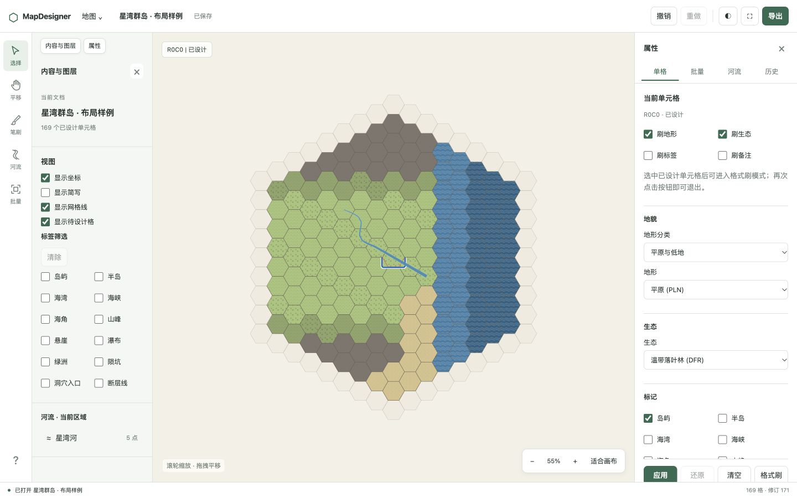
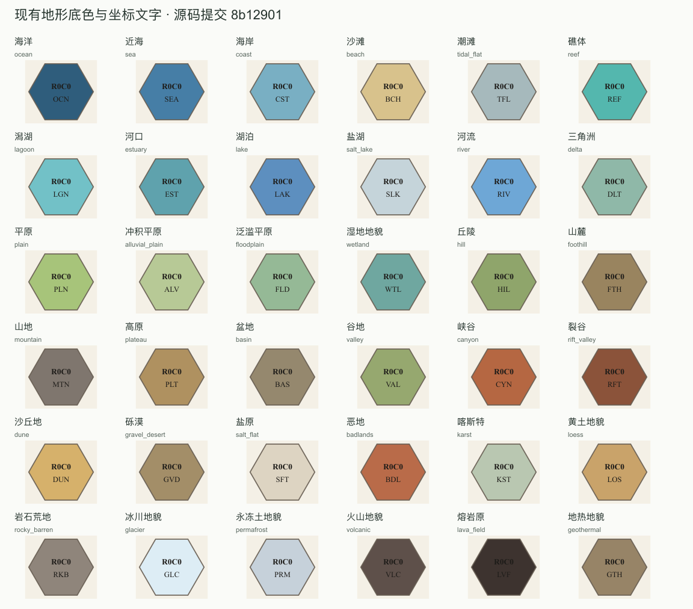
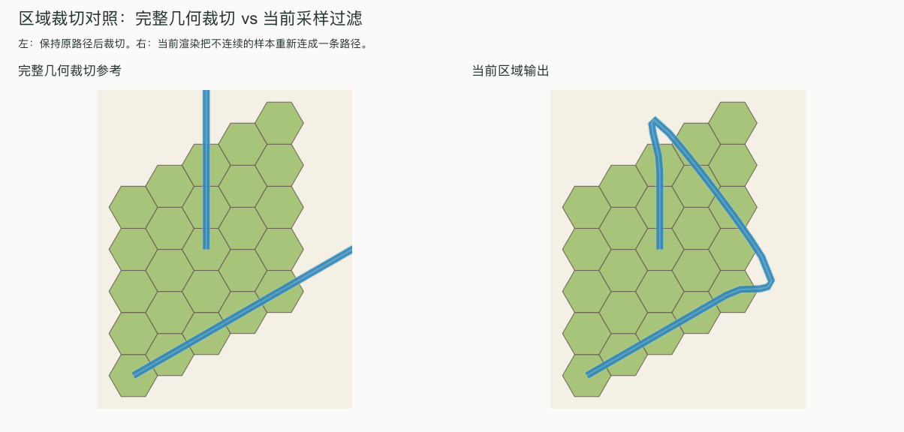

# 视觉、布局与制图表达评估

日期：2026-10-03。应用基线：8b12901b8d86487963790dc776c318f967aa55ca。评估对象为正式 React 编辑器及共享渲染器。

实施清单见 [视觉重构工作清单](../../../archive/plans/2026-10-03-visual-redesign.md)。本目录保存本次评估的原始截图、测量和可复现的绘图样例；应用改造尚未开始。

## 结论

建议重做工作区的信息结构、属性编辑方式和地图视觉体系。当前界面把文档信息、显示设置、筛选、工具参数和对象属性同时摊开，地图缺少足够明确的视觉层次；地形辨识主要依赖底色和低对比纹理，缺少图例和直观符号；河流存在两处已复现的几何表达错误，汇流、入海和湖泊衔接也缺少统一规则。

最先处理的三项是河宽插值、范围裁切产生的错误连线，以及窄屏抽屉遮挡主字段。工作区重构随后围绕“选材料—绘制—选对象—修改—检查—导出”组织。制图方向采用清晰的自然配色、适量地貌符号和连续水面，避免让大量网格、纹理、坐标同时争夺注意力。

此前 174 项自动化测试和浏览器功能验收是功能基线。本次发现补充了视觉及绘图语义上的验收要求。

## 方法与证据边界

- 本轮实际检查 1440×900 桌面、375×812 窄屏，记录 DOM 尺寸、首屏内容、浅色及深色界面和导出对话框。
- 使用现有渲染函数生成全部 36 种地形、30 种生态纹理，以及汇流、急弯、入海、穿湖、裁切和河宽插值样例。
- 对照源码核对工具状态、筛选行为、绘图顺序、河流数据结构和导出实现。
- 标为“确认”的结论来自实际测量、源码或可复现输出；“设计判断”说明影响和改善方向；“待验证”需要新实现、专项样例或真实使用者验证。
- 本轮没有进行真实使用者辨识测试、真实触摸设备测试或完整读屏验收。1024×768、812×375 在此前功能验收中检查过，新的视觉布局仍需重新验收。
- 对比度数值比较不透明文字色与基础填充色，未逐像素分析纹理、透明度与抗锯齿。它们定位风险，不等同于整张地图的无障碍合规结论。

## 界面与操作

| 编号 | 证据与判断 | 调整要求 |
| --- | --- | --- |
| U01 | **确认 + 设计判断。** 桌面工具栏宽 58px，内容栏 218px，属性栏 294px，画布宽 870px，占窗口宽度 60.4%。标签筛选占高 291.5px，普通单格编辑中的格式刷设置及说明占高 132.6px。空间优先级不符合常用编辑任务。 | 默认只展开当前任务需要的侧栏；重新组织导航、工具选项和上下文属性。 |
| U02 | **确认。** 工具文字及状态栏为 10px，部分元信息 11px，字段标签 12px。辅助文字色对白底约 4.15:1，对浅灰底约 3.85:1。 | 调整字号、字重和明暗层级，主要信息不能依靠小号低对比文字承载。 |
| U03 | **确认。** 375×812 属性抽屉高约 446.6px，底部操作区从 y=728 开始；分类控件范围约 y=717.1—755.1，发生重叠。地形和生态控件分别从 y=787.6、917.6 开始，位于首屏抽屉之外。 | 修复内容区与操作栏的尺寸约束；首屏优先显示地形和生态，补充滚动留白及软键盘适配。 |
| U04 | **确认 + 设计判断。** 左侧有选择、笔刷、河流、批量工具；右侧另有单格、批量、河流、历史四个固定页签。格式刷参数常驻单格首屏；“笔刷”依赖已有源格。用户需要在多个入口拼接同一任务。 | 由当前工具和选中对象驱动唯一的上下文面板；独立提供材料笔刷和取样/格式刷。 |
| U05 | **确认。** “内容与图层”混合地图摘要、视图开关、标签筛选和当前区域河流；河流列表只取当前载入数据的前 200 项。缺少全图对象检索和地形图例。 | 分别提供显示控制、材料/图例和可分页的全图对象列表，标明筛选范围及数量。 |
| U06 | **确认。** 当前生态会过滤可选地形及地形分类。例如选中温带落叶林时，“水域”不在分类选项中。要从林地改成湖泊，需要先处理已有生态。 | 保持所有地形可发现，明确解释组合约束；换地形时预览受影响的生态，并作为一次可撤销修改。 |
| U07 | **确认。** 河流面板要求输入“R0C0, R1C0…”路径和“R0C0:2…”宽度锚点；河流图层禁用指针命中。 | 提供画布选取、节点拖动、宽度手柄和数值面板，文本路径移至高级入口。 |
| U08 | **确认 + 设计判断。** 深色工作区搭配固定浅色地图背景；导出对话框使用硬编码白底。地图和界面可采用不同主题，但目前缺少明确的亮度和浮层规则。 | 统一界面浮层主题；区分工作区主题与地图样式，让导出预览真实反映地图配色。 |

[窄屏属性抽屉](./narrow-before.jpg) · [深色河流面板](./river-inspector-dark.jpg) · [深色下的导出对话框](./export-dialog-dark.jpg) · [原始布局测量](./layout-measurements.json)

## 地形、生态与图例

| 编号 | 证据与判断 | 调整要求 |
| --- | --- | --- |
| C01 | **确认 + 设计判断。** 36 种地形采用固定底色。山地、盆地、高原等缺少专属地貌形状；低地、丘陵、谷地等存在近似色。山地用灰褐色、水体用蓝色的方向可以保留，但单靠颜色难以让细分类一眼可辨。 | 明确地貌、生态和标记的编码分工；使用颜色家族、轮廓/符号和按需说明共同表达。 |
| C02 | **确认。** 温带雨林和季雨林使用完全相同的纹理；多种生态主要靠圆点密度或短划线变化区分。“裸地”也有点纹。**设计判断：** 缩小后多种纹理接近，海面重复波纹较强。 | 先区分森林、草地、湿地、荒漠、水域等大类；近似亚类由图例、文字和细节级别补充，避免强求 30 种密纹同时出现。 |
| C03 | **确认。** 当前没有可见的地形图例；主要标记以 PEK、WFL、OAS 等英文缩写表达。 | 地形库、画布图例、属性样本和导出图例共用真实绘图样本；常见标记使用可解释的图形符号。 |
| C04 | **确认 + 设计判断。** 地形分类把地势、成因及气候混在同一级，盆地和谷地位于“高地与山地”。这不意味着这些地貌不能处于高地，但不利于查找。格子地形“河流”与独立河流对象也缺少清晰区分。 | 调整显示分组及释义，保留已有数据键；清楚解释水域格子、河道路径、河口、三角洲和湿地的含义。 |
| C05 | **确认。** 所有已设计格的文字采用固定深色；36 种基础底色中有 8 种与该文字的对比度低于 4.5:1，熔岩原约 1.40:1、海洋约 2.44:1。河流绘制在单格文字之后；远景中含河流的整块会被染蓝。 | 文字采用适配背景的颜色或衬底；定义标签避让与绘制顺序；远景单独表达河网，避免夸大水域面积。 |

[全部生态纹理对照](./biome-atlas.png)。生态图使用统一平原底色以隔离纹理差异，不代表这些组合都能在编辑器中设置。

制图常识的应用边界：本项目没有真实高程和水深数据，颜色和地貌符号应表达地形类别，不能标成实测高程或水深。河流宽度也不代表已经计算过流量。风格可以服务于虚构地图，同时保持水陆、山地、森林等基本视觉线索清楚。

## 河流与水系

| 编号 | 证据与判断 | 调整要求 |
| --- | --- | --- |
| R01 | **确认的几何缺陷。** 路径从 R0C0（宽 2）到 R0C10（宽 22），R0C1 的宽度为 4；在 R0C1 插入一个未设宽度的控制点后，该处变成 12。缺省控制点宽度按控制点序号插值。 | 用沿路径累计距离插值；增加不改变路径的控制点时，宽度分布应保持一致。处理旧地图的宽度语义兼容。 |
| R02 | **确认的几何缺陷。** 河流离开范围后再次进入，渲染器过滤掉范围外样本，再把剩余样本当作一条连续路径绘制。样例发现一处不相邻样本被直接连接，出现本不存在的斜线。 | 保留分段身份与边界交点，在完整局部几何上裁切；视口边界不能变成新河口。 |
| R03 | **确认 + 设计判断。** 每条河流独立绘制河岸、水面和高光；汇流点仍保留独立路径的高光、端部和透明度叠加。没有显式汇流关系。 | 同一水系在连接处合成连续水面，消除穿过汇流点的内岸和独立端帽；连接关系由用户明确建立。 |
| R04 | **确认。** 接水只根据起终点格子的地形判断，端点宽度乘以 1.2。入海样例在水面上保留独立末端，穿湖样例仍出现贯穿湖面的河道色带。 | 引入水面边界及遮罩，分别处理入海、入湖、出湖和陆地源头；河口扩展应有过渡长度。 |
| R05 | **待专项验证。** 河带由局部法线偏移形成，缺少明确的尖角限制、重叠合并和自交处理。回折压力样例可见环形叠线，但输入本身也有回折，不能据此断言简单不相交路径一定会被绘制成自交。 | 用不自交中心线、极窄弯、宽河、重复点和折返分别验证；限定曲线过冲和内岸退化。 |
| R06 | **确认的模型限制。** RiverFeature 只有点序、可选宽度、颜色和透明度，没有独立流向、汇流节点、支流归属或河口类型。河道视觉相交不能可靠区分连通与跨越。 | 增加最小的显式连接与方向语义，旧地图默认“未指定”；支持汇合、分汊和连接解除，并兼容导入导出及历史。 |

左侧保留原路径后按相同窗口裁切；右侧为当前区域输出。两者来自同一条河流。

[控制点改变河宽的对照](./width-control-dependence.png) · [六种水系场景](./river-scenarios.png) · [数值测量](./render-metrics.json)

水系设计不采用“下游必须一直变宽”“所有交叉都必须连接”“所有入海口都是三角洲”等强制规则。默认样式可提供自然的宽度过渡；局部收窄、分汊、内流终点和人工设定应可表达。没有高程、流量和潮汐数据时，合理性检查只能提示显著的连接或表达矛盾。

## 实现定位

| 范围 | 主要文件与函数 |
| --- | --- |
| 文档栏、工具、侧栏与属性布局 | [App.tsx](../../../../apps/web/src/App.tsx)、[TopToolbar.tsx](../../../../apps/web/src/TopToolbar.tsx)、[ToolRail.tsx](../../../../apps/web/src/ToolRail.tsx)、[SidebarPanel.tsx](../../../../apps/web/src/SidebarPanel.tsx)、[DetailPanel.tsx](../../../../apps/web/src/DetailPanel.tsx)、[editor.css](../../../../apps/web/src/editor.css) |
| 地形/生态联动、笔刷和批量流程 | [useCellEditor.ts](../../../../apps/web/src/useCellEditor.ts)、[AdvancedEditPanel.tsx](../../../../apps/web/src/AdvancedEditPanel.tsx) |
| 画布命中、标签、河流图层与远景 | [MapCanvas.tsx](../../../../apps/web/src/MapCanvas.tsx) |
| 地形分组、生态组合、标记释义 | [dictionaries.ts](../../../../packages/map-core/src/dictionaries.ts) |
| 河流数据及宽度规则 | [types.ts](../../../../packages/map-core/src/types.ts)、[rivers.ts](../../../../packages/map-core/src/rivers.ts) 中的 pointWidths、expandRiverPath、getRiverEndpointConnections |
| 配色、纹理、河带及输出 | [styles.ts](../../../../packages/map-render/src/styles.ts)、[scene.ts](../../../../packages/map-render/src/scene.ts) 中的 buildRiverBodies、buildRiverBandPath、renderSvgString |

## 复现

从对应源码版本构建，再运行探针。探针仅构造内存样例，不调用业务 API 或修改数据库。默认输出到系统临时目录，避免覆盖本目录的历史证据；可通过第一个参数指定输出目录。

~~~sh
pnpm build
node docs/research/2026-10-03/visual-audit/render-probes.mjs
~~~

渲染依赖现有构建产物和服务端已安装的 sharp。渲染脚本记录运行时源码提交，调用前需要确认构建产物与源码一致。文字排版受系统字体影响。浏览器截图来自本机“星湾群岛 · 布局样例”，不是自动化截图基准。

本次已执行探针并检查输出；应用源代码没有变更，因此没有重复执行整套功能测试。

## 可读性参考

已核对 [W3C：Understanding SC 1.4.3 Contrast (Minimum)](https://www.w3.org/WAI/WCAG22/Understanding/contrast-minimum.html)，读取日期 2026-10-03。普通文字的 4.5:1 和大号文字的 3:1 用于制定文字验收标准。地图中任意两种地形颜色不要求机械地满足文字对比度阈值；应使用符号、图例和必要的轮廓补充辨识。

识别耗时、美观程度、视觉疲劳和任务效率尚未经过真实用户验证。后续应以固定地图及同一组任务做前后对照，记录具体误认和操作障碍。
