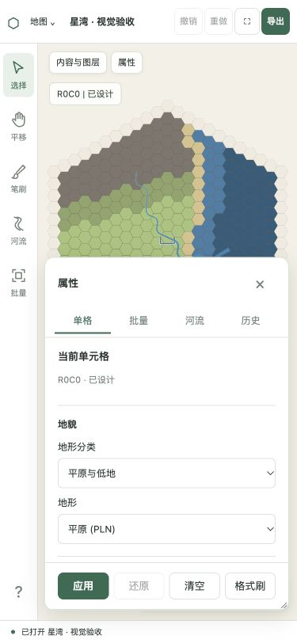

# 视觉重构实施验证

日期：2026-10-03。对应 [48 项工作清单](../../../VISUAL_REDESIGN_PLAN.md)。本记录随实施更新。

## 第一阶段：正确性与窄屏遮挡

- 河流先建立完整曲线，再按连续片段显示。高、低细节下，裁切片段的每个中心线点均能对应到原曲线；范围外的河口不再影响可见片段的端部。3 项回归在旧实现失败，修复后通过。
- 河宽使用沿程距离插值，新控制点不改变原宽度序列。旧数据保留原宽度规则，进入编辑时固定有效锚点；新旧历史按各自规则执行。见 [兼容说明](../../../RIVER_WIDTH_COMPATIBILITY.md)。
- 属性面板的滚动字段区与底部操作区采用独立布局。格式刷参数仅在对应工具启用时显示，按钮的文档顺序跟随字段，便于键盘从最后一个字段进入“应用”。
- 构建和类型检查通过；完整回归共 183 项（core 28 / render 10 / server 86 / web 59）。窄屏结构调整后再次通过 web 类型检查及 59 项现有流程测试。

| 浏览器尺寸 | 测量结果 |
| --- | --- |
| 375×812 | 字段区下沿 y=710，操作区上沿 y=710，无重叠；首屏地形分类与地形可见。滚动到底部后备注下沿 y=680，按 Tab 进入“应用”。 |
| 812×375 | 字段区下沿和操作区上沿均为 y=286；键盘定位后的地形控件可见高度 35px，无操作栏遮挡。 |

[最后一个字段](./narrow-last-field-p0.jpg) · [横屏](./landscape-p0.jpg) · [原始测量](./layout-p0.json)

浏览器使用独立样例数据，样例见 [星湾](../../../design/editor-v3/fixtures/visual-estuary.json)。工作区整体重排、抽屉状态和真实手机软键盘验收将在后续阶段完成。

## 工作区与材料流程（第二批）

桌面 1440×900 的默认单侧栏为 320px、工具栏 64px、画布 1056px，没有页面水平溢出。选中格子自动切换到属性；点击全图河流搜索结果自动定位并显示河流属性。

375×812：地形与生态在半屏属性内可见；一次测量的生态底部 616.8px、字段滚动区底部与操作区顶部均为 641px。展开抽屉后备注可达，Tab 从备注进入“应用修改”。从平原/草原直接改为湖泊，生态清空提示明确；切换到材料栏再返回仍保留该草稿，随后还原。812×375：滚动区底部与操作区顶部均为 288.8px，没有水平溢出。上述为桌面浏览器尺寸模拟。

截图：narrow-workspace.jpg、narrow-expanded.jpg、landscape-workspace.jpg、dark-history.jpg。截图保留阶段状态，最终版本仍需统一重拍与检查。

新的回归覆盖：无源格材料绘制及撤销、切换工具保留草稿、地形直接转水域、河流元数据和共享节点在名称编辑中保留、超过 200 条对象的全图分页查询。构建/类型检查通过，核心 33、渲染 10、服务端 90、网页 62 项测试通过。

## 收尾验收：地图、导出与性能

本轮功能批次为 bf1bfe7，选择反馈及测试效率修正为 870bd3c。构建、类型检查及 214 项测试通过（core 33 / render 16 / server 96 / web 69）。生产容器已通过非 root 身份、令牌、CJK 字体、后台预览、含中文标题和图例的 PNG 下载检查；最终 CI 结果在文末记录。

### 视觉与任务检查

- 完成材料搜索、地形转换及生态说明、笔刷预览/一次撤销、多选的混合值与实际变化数量、全图对象定位、河流节点及宽度、连接及分支、真实导出预览。之前的行为检查和截图保留，不改写原审查报告。
- 14 组合法地图及共享渲染输出见 [样例数据](../../../design/editor-v3/fixtures/cartography-gallery.json) 和 [图集](./gallery/)。浏览器入口 /visual-qa.html 可查看同一配置的 SVG/PNG、灰度、绿色觉缺失和红色觉缺失模拟。
- 森林/山地、荒漠/冰雪、密集标记、急弯、交汇、入海、穿湖及三角洲均作视觉检查。主要家族有形状补充；相近生态亚类仍需近景及图例识别，不能宣称所有 30 种生态在缩略图都能凭直觉命名。
- 入湖/穿湖中心保持纯湖面；显式交汇没有重复端帽及内部叠色。交换对象顺序、急弯中心像素、区域裁切和宽度插值有行为或真实像素回归。独立交叉保留不同路径，不推断连接；湿地和三角洲仍属于陆地地貌。
- 实际导出星湾地图为 2808×2927px（标题、说明、图例、方向及格距），浏览器显示成功并给出再次下载链接，隔离存储中的 PNG 已生成。小尺寸透明导出的预览与 PNG 像素完全一致有回归；大图预览是缩略图，不作逐像素相等声明。
- 14 个界面文字/背景组合全部至少 4.5:1；浅色最小 5.10，深色最小 5.07。见 [对比度数值](./contrast.json)。导出、帮助、历史使用深浅主题，地图样式保持独立。
- 键盘实测导出按钮 Tab 回到关闭按钮、Escape 返回触发入口；节点宽度键盘调整和撤销已实测。最终选中河流会在工具上下文显示名称，焦点沿河道显示，不再出现覆盖整片地图的浏览器默认方框。

[导出桌面](./export-desktop.png) · [深色导出](./export-dark.png) · [深色帮助](./help-dark.png) · [历史](./history-final.png) · [森林色觉模拟](./forest-deutan.png) · [荒漠冰雪色觉模拟](./dry-ice-protan.png) · [密集标记](./markers-comparison.png)

色觉模拟采用 Machado、Oliveira、Fernandes（2009）的二色视觉矩阵，在线性 RGB 中应用。它仅辅助设计检查，没有替代真实色觉差异使用者的观察。

### 响应式复核

此前属性面板在桌面浏览器尺寸模拟中完成 375×812 与 812×375 的首尾字段及操作区验证。收尾时浏览器尺寸覆盖接口没有改变已有标签页，所以新增开发验收页 /responsive-qa.html，把正式编辑器放入明确尺寸的 iframe；下表为实际 CSS 视口测量，不能称为真实设备或浏览器页面缩放测试。

| CSS 视口 | 内容区下沿 | 操作区上沿 | 页面宽度 | 结果 |
| --- | ---: | ---: | ---: | --- |
| 375×812 | 710 | 720 | 375 | 预览和字段滚动，按钮可达 |
| 812×375 | 249 | 265 | 812 | 预览独立滚动，不越过操作栏 |
| 1024×768 | 642 | 658 | 1024 | 无水平溢出 |
| 1440×900 | 708 | 724 | 1440 | 双列导出选项和预览 |

横屏复核曾发现预览最小高度覆盖下载按钮，已修复并重测。数据见 [布局记录](./layout-final.json)，截图 [375×812](./export-375x812.png)、[812×375](./export-812x375.png)。

### 性能方法与结果

同机 Apple M5 / Node 24.16。CPU 基线是 8b12901，浏览器历史版本也从该提交隔离准备，访问 5174 获用户明确授权后补测。当前浏览器性能取正式 MapCanvas，1200 个实际加载格子及跨越两万格的长河；10k/100k/500k 是地图摘要总数，不表示浏览器同时渲染全部格子。每组 10 次预热、40 次缩放采样，帧耗时为 rAF 间隔，交互为事件到两次 rAF 的近似值，排除网络读取。

| 摘要总格数 | 旧版帧 P95 | 新版帧 P95 | 旧版交互 P95 | 新版交互 P95 |
| --- | ---: | ---: | ---: | ---: |
| 10,000 | 16.8ms | 18.6ms | 39.4ms | 41.6ms |
| 100,000 | 16.7ms | 16.7ms | 33.7ms | 42.3ms |
| 500,000 | 16.8ms | 16.8ms | 36.6ms | 39.3ms |

全部低于计划的 33ms 帧预算和 100ms 交互目标。新增细节有成本，不宣称浏览器性能全面提升。新版 DOM 为 6085 元素，旧版 4899；JS 堆约 64–122MiB，受垃圾回收影响，不能用单点内存证明下降。CPU 场景构建 P95 为 12.32 / 7.27 / 7.17ms；该数值不等同于浏览器帧耗时。

实际 SQLite 数据另外测量，使用隔离数据库的 10k/100k/500k 地图。区域请求包括路由、SQL 和 JSON 序列化，使用 Fastify 内部请求，排除网络；区域导出固定 1200 格、1×、图例和标题。

| 实际格数 | 区域读取 P95 | 概览首次 | 全图使用类型 | 预览 | 区域 PNG |
| --- | ---: | ---: | ---: | ---: | ---: |
| 10,000 | 10.31ms | 24.38ms | 1.90ms | 363ms | 3.23s |
| 100,000 | 2.69ms | 44.86ms | 13.12ms | 304ms | 3.16s |
| 500,000 | 3.06ms | 205.18ms | 77.07ms | 306ms | 3.21s |

概览上限 4096 块，独立河网点上限 100,000，超限有细节限制提示；几何缓存最多 128 项/100,000 点。五十万格概览首次耗时超过 100ms，属于数据加载，不混入浏览器交互指标；界面保留加载状态。任务和 PNG 仍受已有格数、像素、时间和工作线程内存上限约束。进程 RSS 包括 SQLite、原生图片缓冲和顺序样例残留，不是单幅地图的峰值。

原始记录：[CPU 前](./performance-before.json)、[CPU 后](./performance-after.json)、[浏览器前](./browser-performance-before.json)、[浏览器后](./browser-performance.json)、[实际数据](./data-performance.json)。重放方法见开发说明。

### 逐项证据索引

| 项目 | 完成内容与证据 |
| --- | --- |
| F01 | 正式工作区作为可操作原型；桌面、窄屏、绘制/属性/河流/导出起止状态及截图 |
| F02 | editor.css 语义变量、统一图标/浮层、上下文选择状态；editor-v3 规范 |
| F03 | 显式 junction_id、流向与端点；river-network 回归及网络规范 |
| F04 | 旧 JSON、SQLite、历史、样式及宽度兼容；compatibility 与 cartography-compatibility 回归 |
| L01 | 默认单侧栏画布 73.3%，面板调宽/固定/专注，偏好记忆 |
| L02 | 单格核心字段首屏、河流结构化属性、内容与按钮分离 |
| L03 | 代码与受控尺寸遮挡检查完成；真实手机软键盘仍未完成 |
| L04 | 文档菜单、修改状态、草稿保护、重试、菜单/对话框焦点 |
| L05 | 各图层独立显示，标签筛选独立；显式复制画布选项至导出 |
| L06 | 实际渲染材料、搜索/分组/最近、兼容生态说明 |
| L07 | 全图搜索与分页；253 条河流可找到最后一条的回归 |
| L08 | 无源格材料绘制、取样、预览、一次手势一次历史、取消回归 |
| L09 | 混合值、保持/设置/清除、真实变化计数、空操作限制 |
| L10 | 独立历史与修改对象摘要，撤销项可见，帮助及任务取消/下载入口 |
| V01 | 14px 正文、14 组文字对比度，地图文字衬底及 PNG 字体一致 |
| V02 | 统一 SVG 图标、文字提示、焦点和主要触摸目标 |
| V03 | 深浅导出/历史/帮助浮层；工作区主题与地图样式独立 |
| V04 | 悬停/焦点/选区/笔刷/草稿分层，近景标记及文字，河流焦点沿路径 |
| V05 | 动作对象、空/无结果/失败状态、中文换行和导出状态密度 |
| T01 | 36 地形/30 生态简释；地貌、水域及河流区分 |
| T02 | 色彩家族、灰度与两种色觉模拟；不声称真实海拔/水深 |
| T03 | 山地、丘陵、高原、峡谷、沙丘、冰川等形状与森林避让样例 |
| T04 | 独立生态纹理、随尺寸缩放、远景抑制；森林对照 |
| T05 | 地点图形、双标记及数量补充；密集标记对照 |
| T06 | 全图已用类型接口、临时高亮、材料/画布/导出共享图例 |
| T07 | 开放水面外岸线、内部网格减弱、无网格轮廓；海岛/湖泊样例 |
| T08 | 远景独立河网、分级显示和阈值缓冲；概览范围回归 |
| R01 | 沿程距离插值、无宽度节点细分回归、旧宽度兼容 |
| R02 | 连续段裁切、交点、极宽河道；原缺陷回归及 clipped 样例 |
| R03 | 约束曲线、稳定河带、急弯/折返及像素检查 |
| R04 | 吸附、连接/断开、流向、同步节点及原子撤销 |
| R05 | 多支/不同宽度/不同样式交汇，顺序无关像素回归 |
| R06 | 细/宽/斜入海，真实水边界及源头收束；mouths 样例 |
| R07 | 入湖/出湖/穿湖；湖中心像素与纯水面一致 |
| R08 | 数值、宽度双侧手柄、方案与沿程预览，键盘/缩放/撤销回归 |
| R09 | 命中、节点移动/插入/移除，预览、取消和一次提交 |
| R10 | 原子分支、解除/撤销及 delta 样例，不自动推断三角洲 |
| R11 | 可定位、可忽略的局部编辑建议；明确非水文模拟 |
| O01 | 共享表示、纹理和字体；浏览器/PNG 对照、编辑辅助排除 |
| O02 | 后台真实预览、范围/像素/背景、修订检查及稳定任务状态 |
| O03 | 标题/说明/图例独立排版，透明说明底、图面方向及格距 |
| O04 | atlas-v1/classic-v1 保存、重开、导出与撤销 |
| O05 | 同机 CPU/浏览器基线与复测、实际三档数据库、限额和方法边界 |
| Q01 | 14 个合法固定样例及 SVG/PNG、两处原河流缺陷 |
| Q02 | 宽度、裁切、迁移、连接、取消、历史及像素回归；遮挡实测 |
| Q03 | 四种 CSS 视口、桌面键盘/焦点已查；真实设备/读屏/200% 页面缩放未完成 |
| Q04 | 未招募首次使用者；作者视觉检查不能替代至少三人的定性测试 |
| Q05 | 分阶段提交、用户手册、规范、图集、性能、CI 与容器记录；外部验收项单列 |

### 尚未完成的外部验收

L03 的真实手机软键盘；Q03 的真实触摸、双指缩放、安全区域、读屏体验和浏览器 200% 页面缩放；Q04 的首次使用者定性测试。当前工具的页面缩放快捷键没有改变可测量的页面尺寸，因此没有把 CSS 视口或图片放大记作 200% 浏览器验收。尚未获取设备或招募参与者，以上三项保留未勾选。

收尾补充：生态样本自动选择兼容的地貌底色，淡水等不再放在不兼容的平原上。CI 曾暴露两项坐标密度测试的重复渲染超时，改为同等累计缩放量后保留原断言；格式刷验收按真实顺序先进入工具，再修改可见字段，并核对实际提交。最终远端结果待下方记录。
