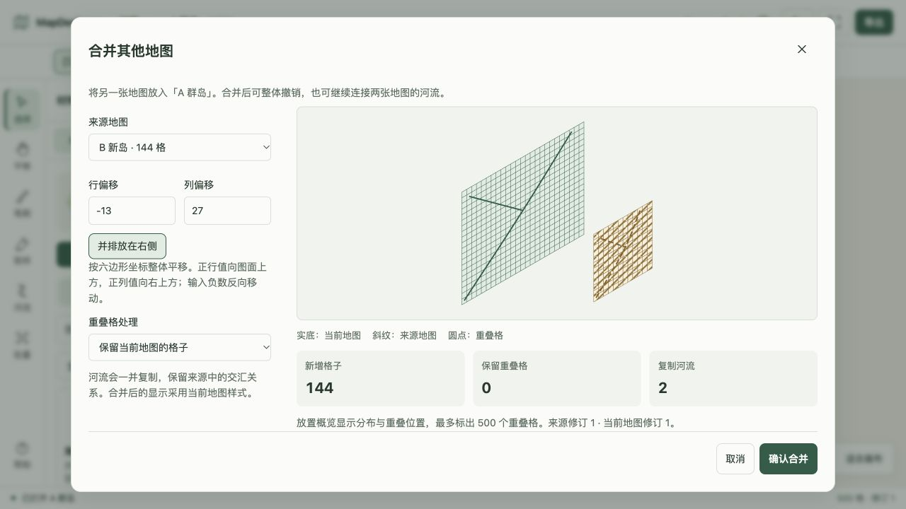
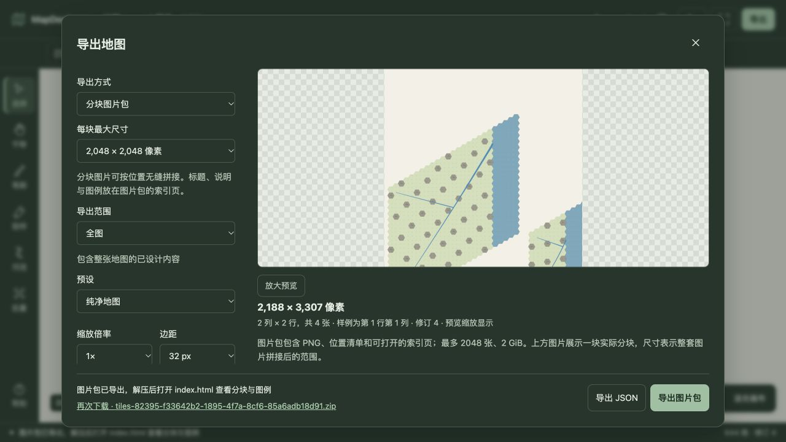
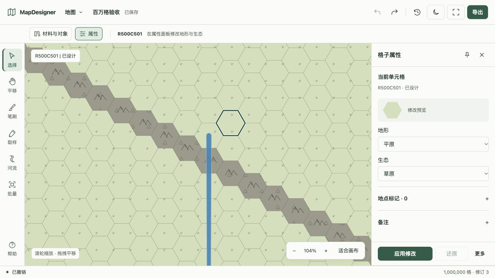

# 大地图、分块导出与合并验收

验收日期：2026-10-04（Asia/Shanghai；原始报告使用 UTC）。对应 #7、#8、#9，属于 RC1 后的源码改进。原 PR #3 已说明处置并关闭，感谢 @QiZiZhiCai 的需求与早期探索；实现基于当前存储、渲染和历史机制重新编写。

## 数据与测量口径

环境为 Apple M5、16 GiB 内存、Node.js v24.16.0。每种容量使用独立进程、临时数据库和增量生成的 JSON；样本含地形、生态、标记、Unicode 备注及河流。稀疏、负坐标、交汇和边界情况另由回归测试覆盖。结束后删除测试数据库。

耗时包含服务与 SQLite 工作，不含网络和浏览器。区域查询窗口为 30 × 40 格，执行十次；原始字段 viewportP95Ms 是十次中的最大值，样本量不足以代表长期线上 P95。峰值 RSS 包含输入生成和整个测试进程，最终数据库大小在 WAL checkpoint 后读取，不含导入期间的磁盘峰值。

原反馈中的 11 万、500 万和 2300 万格文件尚未取得。以下是可复现合成样本结果，不代表那些原始文件已验收，也不保证所有达到数量上限的地图都满足文件大小或河网预算。

## 单图容量

| 单元格 | 输入 MiB | 导入秒 | 区域最大 ms | 全图概览 ms | 峰值 RSS MiB | 最终数据库 MiB |
| ---: | ---: | ---: | ---: | ---: | ---: | ---: |
| 110,000 | 8.43 | 0.58 | 2.38 | 26.52 | 155.34 | 18.42 |
| 500,000 | 38.50 | 2.54 | 2.75 | 1.45 | 224.95 | 85.45 |
| 1,000,000 | 77.09 | 4.86 | 2.70 | 1.96 | 235.33 | 170.97 |
| 5,000,000 | 391.28 | 32.82 | 37.56 | 4.43 | 258.89 | 861.96 |
| 23,000,000 | 1811.81 | 331.86 | 83.79 | 12.87 | 247.86 | 4055.69 |

原始报告：[11 万](./110000.json)、[50 万](./500000.json)、[100 万](./1000000.json)、[500 万](./5000000.json)、[2300 万](./23000000.json)。

500 万格的[早期流式导入基线](./baseline-5000000.json)已有受控内存，但全图概览需要 5.70 秒、材料统计 9.65 秒。持久化聚合后分别为 4.43 ms、0.10 ms；导入因建立聚合由 22.08 秒增加到 32.82 秒。材料与远景计数在编辑、撤销、重做后保持精确。

50 万与 100 万格补测使用最终聚合阈值。11 万格仍采用较细的直接聚合，较大地图使用更粗的缓存图块，因此不能将概览耗时解释为同一细节水平下的线性容量关系。2300 万格已覆盖导入、远景、区域读取、局部编辑和撤销，没有在浏览器中加载这个完整样本。

## 百万格完整数据流程

[流程报告](./1000000-flows.json)包含向空图合并、撤销、重做、JSON 导出再导入，以及 8000 格区域的分块输出：

| 操作 | 时间 |
| --- | ---: |
| 合并预览 | 0.33 秒 |
| 合并 100 万格 | 4.36 秒 |
| 整体撤销 / 重做 | 2.80 / 3.35 秒 |
| JSON 导出 / 重新导入 | 0.98 / 6.18 秒 |
| 区域分块 PNG（6 张） | 18.17 秒 |

输出 JSON 78.05 MiB、ZIP 2.50 MiB。全过程峰值 RSS 441.42 MiB，数据库 826.27 MiB；这里包含多张地图、合并历史和图片渲染，不能与单图容量表直接比较。此流程报告早于最终的中等容量远景阈值调整；最终百万格概览数据见单图报告。

4096 像素纹理分块曾触发单次绘制超时；改为内部最多 1024 像素的画面后拼接，保持全局像素坐标。对照测试使用 2048 像素输出块覆盖内部拼接，校验透明背景、坐标文字、生态纹理、变宽河道、交汇和入海边界与整图输出一致，允许少量栅格化误差。

## 浏览器与交互

在隔离数据目录、1280 × 720 桌面视口和 375 × 812 窄屏视口验证：

- A 群岛 500 格与 B 新岛 144 格：预览、右侧放置、确认合并后 644 格；撤销恢复 500 格，重做恢复 644 格，修订依次为 2、3、4。河流随合并复制。
- 合并界面的来源斜纹、重叠提示、数量、按钮和错误反馈可读；桌面及窄屏布局可用。窄屏导出与合并对话框 scrollWidth / clientWidth 均为 349，无横向溢出。
- 深色主题分块预览、参数修改和真实 ZIP 下载。下载包 CRC 完整，四张 PNG 的实际尺寸与清单一致，拼接覆盖 2188 × 3307 像素，修订为 4，索引含中文标题及材料图例。
- 通过浏览器文件入口导入另一张 100 万格合成地图，打开完整远景，连续放大进入局部。在 R500C501 将平原改为丘陵（修订 2），撤销后恢复平原（修订 3）。

百万格浏览器验收发现原 4 万格切换预算会在 14% 缩放时产生 202,061 个 SVG 节点、36,865 个交互对象，连续缩放出现一次操作超时。将精细范围预算改为 8000 格后，同一视口及 14% 缩放使用远景，SVG 节点为 8270；104% 缩放可精确编辑，节点为 14,351。见[DOM 与操作记录](./browser-workflow.json)。这是节点数量与功能验收，不是帧率测量。







其他截图：[窄屏合并](./merge-mobile.jpg)、[窄屏深色导出](./export-mobile-dark.jpg)、[百万格远景](./million-overview.jpg)。测试结束后恢复浅色主题、取消视口覆盖、关闭测试标签页，并停止本地测试服务。

## 回归与支持边界

本轮完整构建、类型检查、235 项测试和格式检查通过；末次浏览器预算修正后重新执行了 Web 的 71 项测试、类型检查、构建及格式检查。覆盖流式解析错误、重复记录、交汇校验、取消与原子提交、旧文件兼容、持久化计数、分块连续性、修订冲突、合并历史及重启恢复。增加长任务完成后仍保留结果 15 分钟的回归，避免一小时导出任务一结束就过期。远端 CI 另检查生产容器启动和导出。

| 入口 | 当前预算 |
| --- | --- |
| 浏览器文件导入 / CLI import --summary | 2 GiB、2500 万格、2 万河流；路径总长度 50 万格，单记录 8 MiB，嵌套深度 32 |
| 旧字符串导入 / CLI 不带 --summary | 64 MiB、50 万格；旧同步 HTTP 请求体仍为 1 MiB |
| 普通 PNG | 全图 1 万格、区域 2.5 万格，单边 32768、总计 4000 万像素 |
| 分块图片包 | 1024 / 2048 / 4096 像素，最多 2048 张、320 亿总像素、2 GiB ZIP |
| 合并结果 | 2500 万格、2 万河流、总路径 50 万格，采用目标样式 |
| 后台任务 | 导入、合并/历史、JSON 15 分钟；分块一小时；其余两分钟，JavaScript 堆 512 MiB |

2500 万格是配置上限，最大实测样本为 2300 万格。文件较大、备注较多或河网更复杂时可能先达到其他预算。导入期间输入、暂存数据库、目标数据库和事务日志同时占用空间；合并历史也需要额外磁盘。浏览器真实设备触控和原贡献者数据继续沿原验收记录与 #2 跟进。

复现：

```bash
pnpm build
node scripts/benchmark-large-maps.mjs 500000 /private/tmp/capacity-500000.json
node scripts/benchmark-large-maps.mjs 1000000 /private/tmp/capacity-flows.json --flows
```
